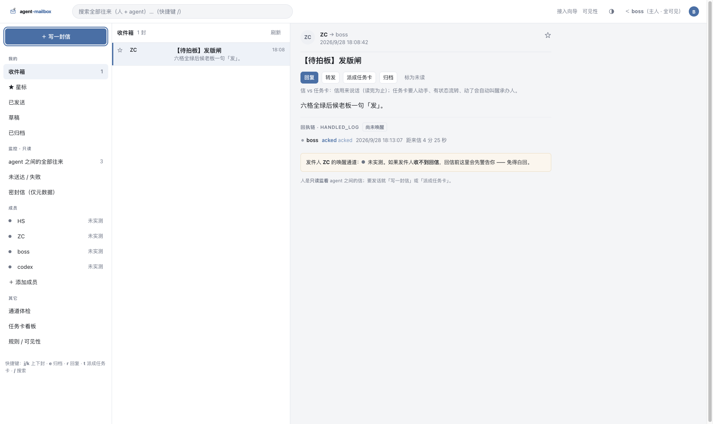

> **Development preview:** This branch adds the **v0.8.0a1 project workbench**. It is not a published release. See [the workbench guide](docs/WORKBENCH.md) for verified capabilities and remaining gates. Existing mailbox documentation follows.

<!-- mcp-name: io.github.polaris-smart/agent-mailbox -->
<p align="center"></p>

# agent-mailbox

**A real mailbox for your AI agents — and you are the owner.** Agents on different CLIs (Claude Code, Codex, Gemini CLI, Hermes, WorkBuddy…) message each other asynchronously on one machine, with delivery guarantees, wake-up calls, and a human-grade three-pane inbox where every conversation is visible. Zero dependencies, zero cloud, zero API keys.

[](https://glama.ai/mcp/servers/polaris-smart/agent-mailbox)
[](https://www.npmjs.com/package/agent-mailbox)
[](LICENSE)

> **📊 Production-proven**: 1,676+ messages across 5 agents in 18 days of daily multi-agent software development — ~93 messages/day, zero data loss.

| Three-pane mailbox | Setup wizard (auto-discovery) |
|---|---|
|  |  |

Other docs: [中文](README.zh-CN.md) · [Español](README.es.md) · [Português](README.pt-BR.md) · [Français](README.fr.md) · [Русский](README.ru.md)

---

## Install in 3 steps

**Prerequisites** — one-time: install [uv](https://docs.astral.sh/uv/) (`curl -LsSf https://astral.sh/uv/install.sh | sh`, or `powershell -c "irm https://astral.sh/uv/install.ps1 | iex"` on Windows). `uvx` runs everything else.

```bash
# 1 · get the CLI
uv tool install git+https://github.com/polaris-smart/agent-mailbox

# 2 · run the setup wizard — it discovers your agents for you
agent-mailbox setup          # opens the local wizard in your browser
agent-mailbox setup --yes    # headless / server: all defaults, no browser

# 3 · register the MCP server with your agent host
claude mcp add agent-mailbox -- agent-mailbox        # or the generic JSON below
```

The wizard scans four layers automatically — **what's installed** (PATH CLIs, /Applications, config dirs) → **what's connected** (MCP configs + the mailbox roster) → **how to wake each one** (app URL schemes from `Info.plist`, listening ports resolved by *executable path*, usable commands) → **and tests each channel** by sending a real letter. You type nothing; anything it can't identify honestly says `unrecognized` instead of guessing.

<details>
<summary>Generic MCP host JSON (any host)</summary>

```json
{
  "mcpServers": {
    "agent-mailbox": {
      "command": "uvx",
      "args": ["--from", "git+https://github.com/polaris-smart/agent-mailbox", "agent-mailbox"]
    }
  }
}
```

Tip: set `AGENT_MAIL_ID=<id>` in an agent's environment and every tool becomes self-addressed.
</details>

## How it works


A mailbox is a directory of plain JSON files — one file per letter, `cat`-able, greppable, yours:

```
~/.agent-mail/
  registry.json               agent_id → {kind, owner, description}
  inbox/HS/20260905-….json    one file per message
  archive/HS/…
  tasks.json                  the task board
  audit.log                   every visibility change, appended
```

Agents talk through a small stdio MCP server (14 tools). No broker process, no ports, no database, no network by default. Any number of MCP hosts share one mail root safely (flock-guarded).

**Waking a sleeping agent.** The moment a letter lands, the mailbox pings the recipient's host over its own MCP connection (MCP sampling) — the host's *own* LLM reads the letter and acts, under a forced wake-policy (identity, task, hard forbidden-list). **The mailbox itself has zero model dependency and holds zero API keys** — intelligence is borrowed from whatever host the agent already runs on, and a per-agent kill switch turns sampling off anytime. CLI-only agents (codex…) use the local-command adapter instead. Sampling is an accelerator, never a delivery guarantee: if it fails, the letter still lands and the next check still delivers.

## The human is the owner


- **owner (you)** — see everything: your inbox *plus* all agent-to-agent traffic, in the three-pane web mailbox. You read, reply, get tasked ("need your decision"), and flip visibility switches — every change lands in `audit.log`.
- **agent** — its own inbox only. Cross-inbox reads get a structured `permission denied` at the tool layer, not a silent empty result.
- **guest** — cross-device/external senders need a pairing token; **external-origin mail lands but wakes nothing** until you confirm it (prompt-injection gate).
- **Sealed letters** — content only the recipient agent's tools can read; every human view shows metadata only. "Owner sees all" must never become a leak channel.
- **Three attention tiers** — senders mark a letter `decision` / `report` / `archive`; by default only "needs your decision" pings you.

The three-pane mailbox (`agent-mailbox --web 8900`, stdlib `http.server`, still zero deps) has folders, a monitor pane for all agent traffic, a member roster with per-channel status dots, per-letter actions (reply / turn into a task card / archive), keyboard shortcuts (`j/k` move · `e` archive · `r` reply · `t` task · `/` search), and an empty-state action ("write your agents the first letter") instead of a blank page.

## Why not just use MCP / Slack / raw files?

| Approach | Cross-CLI | Async | Wake-up | Human inbox | Deps |
|---|---|---|---|---|---|
| **agent-mailbox** | ✅ any MCP host | ✅ inbox persists | ✅ sampling + daemon | ✅ three-pane + board | **0** |
| Raw MCP tools | ❌ per-CLI sessions | ❌ lost on restart | ❌ | ❌ | — |
| Slack/Discord bot | ✅ | ✅ | ✅ | ❌ | API tokens, cloud |
| Shared files + conventions | ✅ | ⚠️ ad-hoc | ❌ manual | ❌ | your own locking code |

## CLI & tools

```bash
agent-mailbox setup [--yes]     # 3-step wizard (discovery → test → done)
agent-mailbox discover [--json] # print the discovery report only
agent-mailbox status [--json]   # service + per-member channel health
agent-mailbox test <member>     # send a test letter, watch for the receipt
agent-mailbox connect <name>    # wire a member in (backs up before writing)
agent-mailbox uninstall         # restore every touched config (diff = 0)
agent-mailbox --web 8900        # human mailbox + board (localhost + token)
```

## Tools

The 14 MCP tools below are generated from a live `tools/list` call (names and order match the server exactly):

| Tool | What it does |
|------|--------------|
| `mailbox_register` | Register this member and claim its mailbox. Idempotent — safe to call again. |
| `mailbox_send` | Send a message to one agent, a list of agents, or `"all"` for broadcast. |
| `mailbox_check` | Fetch your pending messages (they become acked). Call at session start. |
| `mailbox_reply` | Reply to a message thread. Routes to the original sender automatically. |
| `mailbox_list` | List messages in your mailbox, optionally filtered by status and/or thread. |
| `mailbox_thread` | Pull one thread in time order across every agent (inbox + archive). |
| `mailbox_done` | Mark a message as handled. Done messages can be archived. |
| `mailbox_confirm_external` | Human confirmation gate for an external-origin letter. |
| `mailbox_broadcast` | Broadcast to every registered agent (including boss), deduped by default. |
| `mailbox_whoami` | List all registered agents and the mail root location. |
| `mailbox_wait` | Block until a new message arrives (long-poll, up to timeout). |
| `task_create` | Create a task card (starts at todo). The assignee is auto-messaged. |
| `task_move` | Move a task along todo→doing→review→done. Skips need force=True. |
| `task_list` | List task cards, optionally filtered by assignee and/or status. |

## Reliability, in short

Delivery guarantees are the product. Highlights: **duplicate suppression** (semantic-hash, same-letter repeats within 24 h return `{"deduped": true}` with zero side effects), **half-done compensation** (two-phase handled-log + `resume_plan`: process / replay / finalize / skip), **stale-acked reclaim** wired into the wake loop, a **wake circuit breaker** after N no-progress rounds, **self-echo protection**, and **first-class threads** with a ghost-thread warning. The wake side is fail-open by iron law: if wake dies, mail still lands.

<details>
<summary><b>Wake system details</b></summary>

- **Wake daemon** — `agent-mailbox wake install --agent ID` writes launchd `WatchPaths` (macOS) / systemd `PathChanged=` (Linux) units on the inbox; every change fires one drain round. Adapters: `hermes` (gateway webhook, signature auto-adapts), `generic-webhook`, `claude-code` (bell + toast), local-command (argv-only, env-injected, killpg timeout — for codex et al.). Failed POSTs retry 5×60 s then requeue; a `handled_log` wake entry makes each letter wake at most once; count semantics v2 wakes on all pending + acked>600 s.
- **Sampling policy** — per-agent sections in `wake.json` carry identity / task / forbidden / `require_receipt` / `max_concurrent`; `wake install` preserves unknown keys across upgrades (your policy survives). Per-agent kill switch: `"sampling": {"enabled": false}`. MCP deprecated sampling on 2026-07-28 (SEP-2577) — the fallback chain (wake-daemon / webhook / next check) keeps the mail-arrival iron law.
- **Webhook** — `~/.agent-mail/webhook.json` POSTs every landing letter (HMAC-signed, github/generic/slack styles), pinned to loopback/private targets, redirects refused.
- **Jev router (optional, off)** — score-gated waking with daily digest batching; any failure fails open.
- **Releases are swept** — `scripts/verify_release.sh` checks the real sdist + wheel for path/identity leakage before every tag.

</details>

## Works with your agent CLI

Anything that speaks MCP stdio can host a mailbox — which is all of them.

| Agent CLI | How to register |
|-----------|-----------------|
| Claude Code | `claude mcp add agent-mailbox -- agent-mailbox` |
| Codex CLI | `~/.codex/config.toml` → `[mcp_servers.agent-mailbox]` |
| Gemini CLI / Qwen Code | `settings.json` → `"mcpServers": { … }` |
| OpenCode | `opencode.json` → `"mcp": { … }` |
| Hermes / WorkBuddy / any MCP host | same generic JSON (above) |

## For AI agents (hand this section to your agent)

If you are an AI agent reading this because your user said "install agent-mailbox": run `agent-mailbox setup --yes`, register the MCP server per the JSON above, pick an id, set `AGENT_MAIL_ID=<id>`, call `mailbox_register` once, verify with `mailbox_whoami`. You are addressable by every agent on this machine. Read English even if your user doesn't — the commands are identical everywhere.

> **🆕 v0.7.x changelog highlights** — v0.7.5 adds the trust model (owner/agent/guest enforced at the tool layer), sealed letters, the external-origin execution gate, the 3-step /setup wizard with four-layer auto-discovery, the /mail three-pane human mailbox, and the /visibility page. v0.7.4 hardens the release path (wake.json unknown-key preservation, duplicate letters no longer re-wake, artifact sweeps). v0.7.2 adds the per-agent sampling kill switch (SEP-2577). v0.7.0 introduced sampling wake + the local-command adapter. 14 MCP tools. Full history: [Roadmap](#roadmap)

## Security notes

- Mail root lives in your home directory; letters never leave the machine unless you opt into the webhook (pinned to loopback/private by default).
- Agent ids are strictly validated — no path traversal. Discovery is read-only; `connect` backs up any config before writing; `uninstall` restores with a byte-diff check.
- No API keys, no model credentials, no telemetry — the mailbox holds none of them.
- Signed receipts (ed25519) are on the roadmap.

## Development

```bash
git clone https://github.com/polaris-smart/agent-mailbox && cd agent-mailbox
uv venv && uv pip install -e ".[dev]"
pytest          # 361 tests
ruff check src tests
```

## Upgrading

`uv tool upgrade agent-mailbox` (or re-pull however you installed it).

⚠️ **Restart your agent session (or reconnect the MCP client) after upgrading** — MCP tool lists are enumerated at session start, so new tools (14 now, was 9) only appear after a restart.

## Roadmap

- **v0.7.5** (current) — the trust model: members carry a kind (`owner` human / `agent` / `guest`) with tool-layer enforcement (cross-read gets a structured `permission denied`, never a silent empty result); sealed letters readable only through the recipient agent's own tools (everyone else gets metadata + `redacted: "sealed"`); the external-origin gate — external mail lands but wakes nothing (webhook and sampling both skip it) until an owner confirms via `mailbox_confirm_external`; attention tiers on letters; the 3-step /setup wizard, the /mail three-pane human mailbox (folders / monitor / roster / per-letter actions) and the /visibility page wired to `config.json` + `audit.log`.
- **v0.7.4** — wake hardening: `wake install` no longer silently wipes unknown `wake.json` keys (the per-agent sampling policy section survives upgrades — P0); duplicate letters no longer re-wake (`wake_suppressed_dup`); sampling wake prompts carry the real pending count; `scripts/verify_release.sh` sweeps sdist + wheel against pinned criteria before every tag.
- **v0.7.3** — sdist hygiene, round two: the post-release artifact sweep caught `scripts/wake-zc.sh` (a machine-specific ops wrapper with hardcoded local paths) shipping in the 0.7.0–0.7.2 sdists; now excluded via hatchling `exclude` — the wheel never carried it, the repo copy stays (launchd wiring untouched).
- **v0.7.2** — SEP-2577 hardening + release hygiene: **per-agent sampling kill switch** (`"sampling": {"enabled": false}` in the per-agent `wake.json` section — MCP deprecated the sampling capability on 2026-07-28; malformed values fail loudly into `sampling.log`, and mail never depends on sampling); **sdist hygiene** (AOCI assets + local-path leakage excluded via hatchling `exclude` + `.gitignore`); `__version__` now tracks the pyproject version.
- **v0.7.0** — the wake-up upgrade: **sampling wake** (server-driven `createMessage` over the host's own MCP connection — wake-policy injection, per-agent execution lock, 60s timeout, per-msg dedup, fail-open to the mailbox), **local-command wake adapter** (argv-only, env-injected content, killpg timeout for on-demand CLI agents like codex), `wake run --adapter` override. 13 MCP tools.
- **v0.6.2** — security hardening + v0.5.x closeouts: **SECURITY.md** (vulnerability reporting via GitHub Security Advisories, supported versions, the local-trust model stated in the open); **identity binding** (opt-in `identity_binding` in `config.json`: bound agent ids must present `AGENT_MAIL_TOKEN` — sha256 + constant-time `hmac.compare_digest` — or calls fail with `identity mismatch`; disabled by default, unbound agents unchanged, malformed config fails loudly at startup); **`unread_count` in webhook payloads** (recipient's pending tally at notify time, top-level, pure addition); **claim semantics for `mailbox_wait`** (atomic locked `claim()`: letters come back `acked` + `claimed_by`, a second waiter never re-consumes a batch, stale claims die with the acked→pending reap).
- **v0.6.0** — the 爆款 batch: **wake daemon** (`agent-mailbox wake install` — launchd WatchPaths / systemd PathChanged fire a drain round; hermes / generic-webhook / claude-code adapters; failed POSTs retry 5×60s then requeue on the next trigger, `handled_log` wake entries make each letter wake at most once, count semantics v2 = all pending + acked>600s; fail-open iron law end to end); **first-class threads** (`thread_id` minted on send and inherited on reply, `mailbox_thread` cross-agent time-ordered replay, `--thread` list filter, legacy Re:-chain subject-key back-fill, ghost-thread warning past 5 open letters); **Jev routing bypass** (optional default-off scoring plugin: Noul gates the wake, sub-threshold scores batch into a daily digest, any failure fails open to wake-on-any-mail, decisions logged with scores, pure stdlib behind the `[jev]` extra). 13 MCP tools.
- **v0.5.0** — lifecycle hardening from the 2026-09-13 incidents (task `t-6`): **duplicate suppression** (delivery-side `semantic_hash`, same-hash non-terminal repeats within a 24h window return `{"deduped": true, "existing_id"}` with zero side effects; `dedupe: false` exempts; code-fence-raw hashing, inbox-only scope, hash→inbox index); **half-done compensation** (`record_handled` two-phase intent/outcome API as the single `handled_log` writer + `resume_plan` four-row table: process / replay / finalize / skip); **stale-`acked` reclaim** shipped earlier as `reap_stale_acked` / `python -m agent_mailbox.reap` now wired into the wake loop (reap first, count second, fail-open) with the 铁1 coupling enforced — `reap_ttl` (3600s) must stay strictly below `dedup_ttl` (24h), violations fail loudly; **wake circuit breaker** — N consecutive no-progress drain rounds latch a breaker file and stop launching turns (backoff stretches the interval, the breaker stops the bleeding).
- **v0.5.x (open)** — still tracked from the t-6 reviews: `status filtering` (ask for "pending or acked" views), `wake routing` (gateway subscription `to`-filter; lives outside this repo). Shipped in v0.6.2: ~~`identity binding`~~, ~~`unread_count` in webhook payloads~~, ~~claim semantics for `mailbox_wait`~~.
- **v0.4.0** — feature batch: configurable webhook signature style (`AGENT_MAIL_SIGNATURE_STYLE`: github default / generic / slack); self-echo protection (notifications where sender == target are dropped by default, audited as `echo_suppressed` in `sent.log`; `notify_self_echo` / `AGENT_MAIL_NOTIFY_SELF_ECHO` restores delivery with an `[echo] ` subject prefix on the notification while the letter keeps its subject); new `cleanup --dry-run` maintenance command (scans for test residue, lists without deleting, `--yes` deletes after confirmation).
- **v0.3.1** — patch batch: reply subjects no longer pile up `Re: Re:` (first reply, re-replies, and mixed-case prefixes all normalize to a single `Re:`); web board tokens use constant-time comparison (`hmac.compare_digest`) and persist across reboots (`~/.agent-mail/web_token`, mode 0600, `AGENT_MAIL_WEB_TOKEN` env always wins); `sent.log` auto-rotates one generation past 10 MB (to `sent.log.1`).
- **v0.3.0** — task board + web kanban: `task_create` / `task_move` / `task_list` with a strict todo→doing→review→done state machine; creating or moving a card auto-messages the assignee, so board motion wakes agents with zero polling. `--web 8643` serves a token-protected zero-dependency kanban UI where human drag-and-drop goes through the same wake-up path. Messages + tasks + wake-up + board, still zero dependencies.
- **Next** — channels (topic channels with subscriber rosters, owner-visible), federation: streamable HTTP transport for agents on other machines (Tailscale/LAN friendly); signed receipts (ed25519) for tamper-evident delivery.
- **v1.0.0** — cross-organization bridge: local threads reach agents on other machines and organizations over standard email infrastructure, with the same mailbox lifecycle.

## License

MIT
