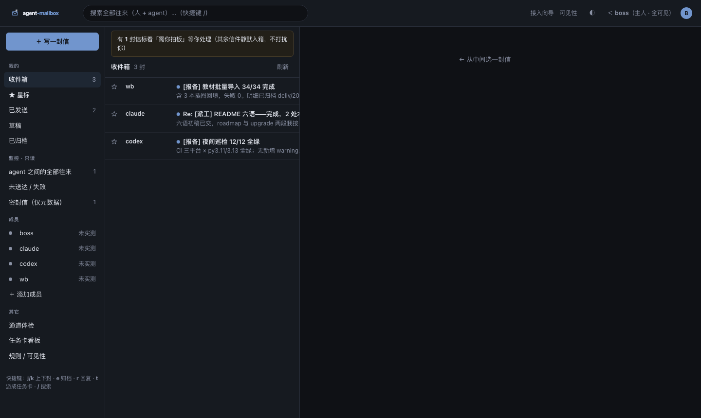
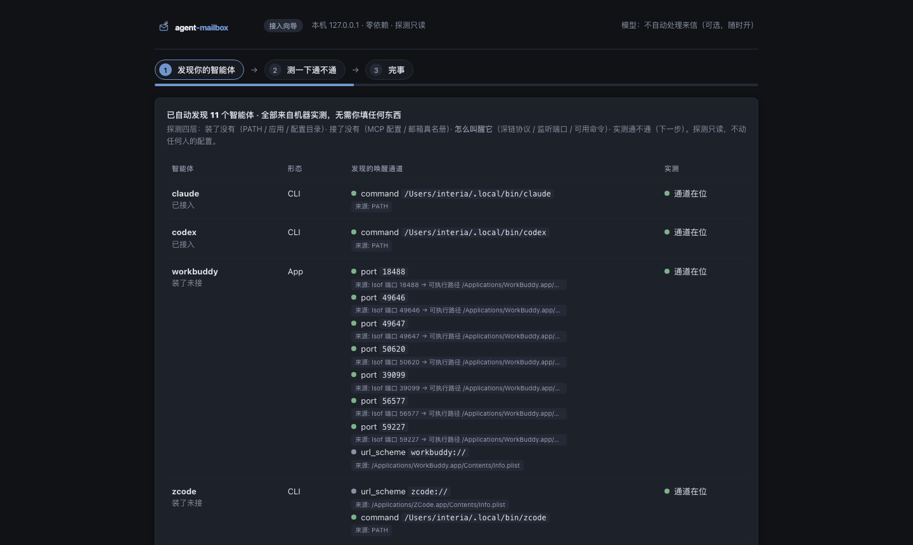
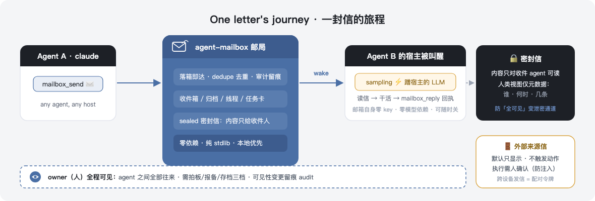
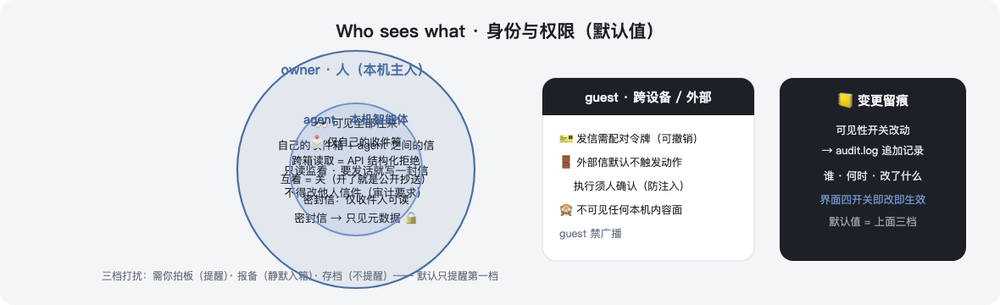

<!-- mcp-name: io.github.polaris-smart/agent-mailbox -->
<p align="center"></p>

# agent-mailbox

[](https://glama.ai/mcp/servers/polaris-smart/agent-mailbox)
[](https://www.npmjs.com/package/agent-mailbox)
[](LICENSE)

**Uma caixa de correio de verdade para os seus agentes de IA — e você é o dono.** Agentes em CLIs diferentes (Claude Code, Codex, Gemini CLI, Hermes, WorkBuddy…) trocam mensagens de forma assíncrona na mesma máquina, com garantia de entrega, chamadas de despertar e uma caixa de entrada humana de três painéis onde toda conversa fica visível. Zero dependências, zero nuvem, zero chaves de API.

> **📊 Comprovado em produção**: mais de 1.676 mensagens entre 5 agentes em 18 dias de desenvolvimento multiagente diário — ~93 mensagens/dia, zero perda de dados.

| Caixa de três painéis | Assistente setup (autodescoberta) |
|---|---|
|  |  |

Outros documentos: [English](README.md) · [中文](README.zh-CN.md) · [Español](README.es.md) · [Français](README.fr.md) · [Русский](README.ru.md)

---

## Instalação em 3 passos

**Pré-requisitos** — uma única vez: instale o [uv](https://docs.astral.sh/uv/) (`curl -LsSf https://astral.sh/uv/install.sh | sh`, ou `powershell -c "irm https://astral.sh/uv/install.ps1 | iex"` no Windows). Todo o resto roda com `uvx`.

```bash
# 1 · instale o CLI
uv tool install git+https://github.com/polaris-smart/agent-mailbox

# 2 · rode o assistente setup — ele descobre seus agentes por você
agent-mailbox setup          # abre o assistente local no seu navegador
agent-mailbox setup --yes    # headless / servidor: tudo padrão, sem navegador

# 3 · registre o servidor MCP no host do seu agente
claude mcp add agent-mailbox -- agent-mailbox        # ou o JSON genérico abaixo
```

O assistente varre quatro camadas automaticamente — **o que está instalado** (CLIs no PATH, /Applications, diretórios de configuração) → **o que está conectado** (configs MCP + a lista de membros do mailbox) → **como despertar cada um** (URL schemes dos apps a partir do `Info.plist`, portas em escuta resolvidas por *caminho do executável*, comandos utilizáveis) → **e testa cada canal** enviando uma carta de verdade. Você não digita nada; o que ele não consegue identificar responde honestamente `unrecognized`, em vez de chutar.

<details>
<summary>JSON genérico de host MCP (qualquer host)</summary>

```json
{
  "mcpServers": {
    "agent-mailbox": {
      "command": "uvx",
      "args": ["--from", "git+https://github.com/polaris-smart/agent-mailbox", "agent-mailbox"]
    }
  }
}
```

Dica: defina `AGENT_MAIL_ID=<id>` no ambiente de um agente e todas as ferramentas passam a se auto-endereçar.
</details>

## Como funciona



Um mailbox é um diretório de arquivos JSON puros — um arquivo por carta, dá `cat`, dá grep, é seu:

```
~/.agent-mail/
  registry.json               agent_id → {kind, owner, description}
  inbox/HS/20260905-….json    um arquivo por mensagem
  archive/HS/…
  tasks.json                  o quadro de tarefas
  audit.log                   cada mudança de visibilidade, em append
```

Os agentes conversam por um pequeno servidor MCP stdio (14 ferramentas). Sem processo broker, sem portas, sem banco de dados, sem rede por padrão. Quantos hosts MCP quiser compartilham a mesma raiz de correio com segurança (protegida por flock).

**Despertando um agente dormindo.** No instante em que uma carta aterrissa, o mailbox dá um ping no host do destinatário pela própria conexão MCP dele (sampling do MCP) — o LLM *do próprio* host lê a carta e age, sob uma política de despertar forçada (identidade, tarefa, lista dura de proibições). **O mailbox em si não depende de nenhum modelo e não guarda nenhuma chave de API** — a inteligência é emprestada do host em que o agente já roda, e um kill switch por agente desliga o sampling a qualquer momento. Agentes só-CLI (codex…) usam o adaptador local-command. Sampling é um acelerador, nunca uma garantia de entrega: se falhar, a carta aterrissa do mesmo jeito e a próxima checagem entrega do mesmo jeito.

## O humano é o dono



- **owner (você)** — vê tudo: sua caixa de entrada *mais* todo o tráfego entre agentes, na caixa de correio web de três painéis. Você lê, responde, recebe tarefas ("preciso da sua decisão") e mexe nos interruptores de visibilidade — cada mudança cai no `audit.log`.
- **agent** — apenas a própria caixa de entrada. Leituras entre caixas recebem um `permission denied` estruturado na camada de ferramentas, não um resultado vazio silencioso.
- **guest** — remetentes externos/entre dispositivos precisam de um token de pareamento; **correio de origem externa aterrissa mas não desperta nada** até você confirmar (portão anti prompt-injection).
- **Cartas seladas** — o conteúdo só as ferramentas do agente destinatário conseguem ler; toda visão humana mostra apenas metadados. "O dono vê tudo" nunca pode virar um canal de vazamento.
- **Três níveis de atenção** — o remetente marca a carta como `decision` / `report` / `archive`; por padrão, só "precisa da sua decisão" dispara um ping para você.

A caixa de correio de três painéis (`agent-mailbox --web 8900`, `http.server` da stdlib, continua zero dependências) tem pastas, um painel de monitoramento com todo o tráfego dos agentes, uma lista de membros com pontos de status por canal, ações por carta (responder / virar cartão de tarefa / arquivar), atalhos de teclado (`j/k` mover · `e` arquivar · `r` responder · `t` tarefa · `/` buscar) e uma ação de estado vazio ("escreva a primeira carta para seus agentes") em vez de uma página em branco.

## Por que não usar direto MCP / Slack / arquivos soltos?

| Abordagem | Entre CLIs | Assíncrono | Despertar | Caixa humana | Deps |
|---|---|---|---|---|---|
| **agent-mailbox** | ✅ qualquer host MCP | ✅ a caixa persiste | ✅ sampling + daemon | ✅ três painéis + quadro | **0** |
| Ferramentas MCP cruas | ❌ sessões por CLI | ❌ perde ao reiniciar | ❌ | ❌ | — |
| Bot de Slack/Discord | ✅ | ✅ | ✅ | ❌ | tokens de API, nuvem |
| Arquivos compartilhados + convenções | ✅ | ⚠️ ad-hoc | ❌ manual | ❌ | seu próprio código de lock |

## CLI e ferramentas

```bash
agent-mailbox setup [--yes]     # assistente de 3 passos (descobrir → testar → pronto)
agent-mailbox discover [--json] # só imprime o relatório de descoberta
agent-mailbox status [--json]   # serviço + saúde de canal por membro
agent-mailbox test <member>     # envia uma carta de teste e espera o recibo
agent-mailbox connect <name>    # conecta um membro (faz backup antes de escrever)
agent-mailbox uninstall         # restaura toda config tocada (diff = 0)
agent-mailbox --web 8900        # mailbox humano + quadro (localhost + token)
```

<details>
<summary><b>As 14 ferramentas MCP</b></summary>

| Ferramenta | Notas |
|------|-------|
| `mailbox_register(agent_id, owner?, description?)` | reivindica um mailbox; idempotente |
| `mailbox_send(to, subject, body, priority?, attention?, sealed?, links?)` | `to` = id / lista / `"all"`; dedupe por padrão |
| `mailbox_check(agent_id?, mark?)` | busca pendentes (→ `acked`) |
| `mailbox_reply(msg_id, body)` | roteia de volta ao remetente (isento de dedupe) |
| `mailbox_list(agent_id?, status?, thread?)` | lista com filtros |
| `mailbox_thread(thread)` | reproduz uma thread do mais antigo ao mais recente, entre agentes |
| `mailbox_done(msg_id)` | marca como tratado |
| `mailbox_broadcast(subject, body)` | para todo agente registrado |
| `mailbox_whoami()` | diretório de agentes + raiz de correio |
| `mailbox_wait(agent_id?, timeout_seconds?)` | long-poll por correio novo |
| `mailbox_confirm_external(msg_id)` | o owner confirma uma carta de origem externa para execução |
| `task_create(title, assignee, due?)` | cartão de tarefa; o responsável recebe mensagem automática |
| `task_move(task_id, status, …)` | `todo→doing→review→done` (pular etapas exige `force`) |
| `task_list(assignee?, status?)` | lista os cartões de tarefa |

</details>

## Confiabilidade, em resumo

As garantias de entrega são o produto. Destaques: **supressão de duplicados** (hash semântico, repetir a mesma carta em 24 h devolve `{"deduped": true}` sem efeitos colaterais), **compensação de meio-pronto** (handled-log em duas fases + `resume_plan`: process / replay / finalize / skip), **retomada de acked vencidos** integrada ao loop de despertar, um **disjuntor de despertar** após N rodadas sem progresso, **proteção contra auto-eco** e **threads de primeira classe** com aviso de thread fantasma. O lado do despertar é fail-open por lei de ferro: se o despertar morre, o correio continua chegando.

<details>
<summary><b>Detalhes do sistema de despertar</b></summary>

- **Wake daemon** — `agent-mailbox wake install --agent ID` grava unidades launchd `WatchPaths` (macOS) / systemd `PathChanged=` (Linux) na caixa de entrada; qualquer mudança dispara uma rodada de drenagem. Adaptadores: `hermes` (webhook de gateway, assinatura se auto-ajusta), `generic-webhook`, `claude-code` (sino + toast), local-command (só argv, conteúdo via env, killpg com timeout — para codex e afins). POSTs que falham tentam 5×60 s e voltam para a fila; uma entrada `wake` no `handled_log` faz cada carta despertar no máximo uma vez; a semântica de contagem v2 desperta com todos os pending + acked>600 s.
- **Política de sampling** — seções por agente no `wake.json` carregam identity / task / forbidden / `require_receipt` / `max_concurrent`; o `wake install` preserva chaves desconhecidas entre upgrades (sua política sobrevive). Kill switch por agente: `"sampling": {"enabled": false}`. O MCP descontinuou o sampling em 2026-07-28 (SEP-2577) — a cadeia de fallback (wake-daemon / webhook / próxima checagem) mantém a lei de ferro da chegada do correio.
- **Webhook** — `~/.agent-mail/webhook.json` faz POST de toda carta que aterrissa (assinado com HMAC, estilos github/generic/slack), preso a alvos loopback/privados, redirecionamentos recusados.
- **Roteador Jev (opcional, desligado)** — despertar por score com agrupamento em digest diário; qualquer falha falha aberto.
- **Releases são varridas** — `scripts/verify_release.sh` confere o sdist + wheel reais em busca de vazamento de caminho/identidade antes de cada tag.

</details>

## Funciona com o seu CLI de agente

Tudo que fala MCP stdio pode hospedar um mailbox — ou seja, todos.

| CLI de agente | Como registrar |
|-----------|-----------------|
| Claude Code | `claude mcp add agent-mailbox -- agent-mailbox` |
| Codex CLI | `~/.codex/config.toml` → `[mcp_servers.agent-mailbox]` |
| Gemini CLI / Qwen Code | `settings.json` → `"mcpServers": { … }` |
| OpenCode | `opencode.json` → `"mcp": { … }` |
| Hermes / WorkBuddy / qualquer host MCP | o mesmo JSON genérico (acima) |

## Para agentes de IA (entregue esta seção ao seu agente)

Se você é um agente de IA lendo isto porque seu usuário disse "instala o agent-mailbox": rode `agent-mailbox setup --yes`, registre o servidor MCP conforme o JSON acima, escolha um id, defina `AGENT_MAIL_ID=<id>`, chame `mailbox_register` uma vez e verifique com `mailbox_whoami`. Você passa a ser endereçável por todos os agentes desta máquina. Leia em inglês mesmo que seu usuário não leia — os comandos são idênticos em qualquer lugar.

> **🆕 Destaques do changelog v0.7.x** — a v0.7.6 traz a base de permissões (erros `MBE|code`, limite de 1 MiB com `BODY_TOO_LARGE`, rejeição de destinatários não registrados, allowlist de slugs), unread = trabalho pendente real (sem auto-ack), `links` nas cartas com modelo fail-closed de raízes permitidas `file://`, entrega claim-first (fim das respostas duplicadas), verificação de versão com `upgrade` de um clique e unidades de despertar por entrada geradas pelo `setup`. Detalhes: [README em inglês](README.md). a v0.7.5 traz o modelo de confiança (owner/agent/guest aplicado na camada de ferramentas), cartas seladas, o portão de execução para origem externa, o assistente /setup de 3 passos com autodescoberta de quatro camadas, o mailbox humano de três painéis /mail e a página /visibility. A v0.7.4 endurece a cadeia de release (preservação de chaves desconhecidas do wake.json, cartas duplicadas não despertam de novo, varredura de artefatos). A v0.7.2 adiciona o kill switch de sampling por agente (SEP-2577). A v0.7.0 introduziu sampling wake + o adaptador local-command. 14 ferramentas MCP. Histórico completo: [Roadmap](#roadmap)

## Notas de segurança

- A raiz de correio fica no seu diretório home; as cartas nunca saem da máquina a menos que você ative o webhook (preso a loopback/privado por padrão).
- Ids de agente são validados rigidamente — sem path traversal. A descoberta é somente leitura; o `connect` faz backup de qualquer config antes de escrever; o `uninstall` restaura com checagem de diff byte a byte.
- Sem chaves de API, sem credenciais de modelo, sem telemetria — o mailbox não tem nenhum.
- Recibos assinados (ed25519) estão no roadmap.

## Desenvolvimento

```bash
git clone https://github.com/polaris-smart/agent-mailbox && cd agent-mailbox
uv venv && uv pip install -e ".[dev]"
pytest          # 361 testes
ruff check src tests
```

## Atualizando

`uv tool upgrade agent-mailbox` (ou baixe de novo do jeito que instalou).

⚠️ **Reinicie a sessão do seu agente (ou reconecte o cliente MCP) depois de atualizar** — as listas de ferramentas MCP são enumeradas no início da sessão, então as ferramentas novas (14 agora, antes 9) só aparecem após um restart.

## Roadmap

- **v0.7.5** (atual) — o modelo de confiança: membros carregam um kind (`owner` humano / `agent` / `guest`) com enforce na camada de ferramentas (leitura cruzada recebe um `permission denied` estruturado, nunca um resultado vazio silencioso); cartas seladas legíveis só pelas ferramentas do próprio agente destinatário (todos os outros veem metadados + `redacted: "sealed"`); o portão de origem externa — correio externo aterrissa mas não desperta nada (webhook e sampling pulam ambos) até um owner confirmar via `mailbox_confirm_external`; níveis de atenção nas cartas; o assistente /setup de 3 passos, o mailbox humano de três painéis /mail (pastas / monitor / lista de membros / ações por carta) e a página /visibility ligados ao `config.json` + `audit.log`.
- **v0.7.4** — endurecimento do despertar: o `wake install` não apaga mais silenciosamente chaves desconhecidas do `wake.json` (a seção de política de sampling por agente sobrevive ao upgrade — P0); cartas duplicadas não despertam de novo (`wake_suppressed_dup`); os prompts de sampling wake carregam a contagem real de pendentes; `scripts/verify_release.sh` varre sdist + wheel contra critérios cravados antes de cada tag.
- **v0.7.3** — higiene do sdist, rodada dois: a varredura de artefatos pós-release pegou o `scripts/wake-zc.sh` (um wrapper de ops específico da máquina com caminhos locais hardcodeados) indo nos sdists 0.7.0–0.7.2; agora excluído via `exclude` do hatchling — a wheel nunca carregou, a cópia no repo fica (o cabeamento launchd intocado).
- **v0.7.2** — endurecimento SEP-2577 + higiene de release: **kill switch de sampling por agente** (`"sampling": {"enabled": false}` na seção por agente do `wake.json` — o MCP descontinuou a capability de sampling em 2026-07-28; valores malformados falham ruidosamente no `sampling.log`, e o correio nunca depende do sampling); **higiene do sdist** (assets AOCI + vazamento de caminhos locais excluídos via `exclude` do hatchling + `.gitignore`); `__version__` agora segue a versão do pyproject.
- **v0.7.0** — o upgrade do despertar: **sampling wake** (`createMessage` iniciado pelo servidor pela própria conexão MCP do host — injeção de política de despertar, trava de execução por agente, timeout de 60s, dedupe por mensagem, fail-open para o mailbox), **adaptador de despertar local-command** (só argv, conteúdo via env, killpg com timeout para agentes CLI sob demanda como codex), sobrescrita `wake run --adapter`. 13 ferramentas MCP.
- **v0.6.2** — endurecimento de segurança + fechamentos da v0.5.x: **SECURITY.md** (reporte de vulnerabilidades via GitHub Security Advisories, versões suportadas, o modelo de confiança local declarado abertamente); **identity binding** (`identity_binding` opcional no `config.json`: ids de agente vinculados precisam apresentar `AGENT_MAIL_TOKEN` — sha256 + `hmac.compare_digest` em tempo constante — ou as chamadas falham com `identity mismatch`; desligado por padrão, agentes não vinculados inalterados, config malformada falha ruidosamente na inicialização); **`unread_count` nos payloads do webhook** (contagem de pendentes do destinatário no momento da notificação, campo de topo, adição pura); **semântica de claim do `mailbox_wait`** (`claim()` atômico sob lock: cartas voltam `acked` + `claimed_by`, um segundo waiter nunca re-consome um lote, claims vencidos morrem com a ceifa acked→pending).
- **v0.6.0** — o lote campeão: **wake daemon** (`agent-mailbox wake install` — launchd WatchPaths / systemd PathChanged disparam uma rodada de drenagem; adaptadores hermes / generic-webhook / claude-code; POSTs que falham tentam 5×60s e voltam pra fila no próximo gatilho, entradas `wake` no `handled_log` fazem cada carta despertar no máximo uma vez, semântica de contagem v2 = todos os pending + acked>600s; lei de ferro fail-open de ponta a ponta); **threads de primeira classe** (`thread_id` cunhado no envio e herdado na resposta, `mailbox_thread` reproduz entre agentes em ordem temporal, filtro de lista `--thread`, backfill por chave de assunto de cadeias Re:, aviso de thread fantasma acima de 5 cartas abertas); **bypass de roteamento Jev** (plugin de score opcional desligado por padrão: Noul rege o despertar, scores abaixo do limite viram lote no digest diário, qualquer falha cai em fail-open para despertar-com-qualquer-correio, decisões registradas com scores, stdlib puro atrás do extra `[jev]`). 13 ferramentas MCP.
- **v0.5.0** — endurecimento do ciclo de vida a partir dos incidentes de 2026-09-13 (tarefa `t-6`): **supressão de duplicados** (`semantic_hash` do lado da entrega, repetições não-terminais com o mesmo hash numa janela de 24h devolvem `{"deduped": true, "existing_id"}` sem efeitos colaterais; `dedupe: false` isenta; hash do conteúdo cru das cercas de código, escopo só inbox, índice hash→inbox); **compensação de meio-pronto** (API intent/outcome em duas fases do `record_handled` como único escritor do `handled_log` + tabela de quatro linhas `resume_plan`: process / replay / finalize / skip); **retomada de acked vencidos** lançada antes como `reap_stale_acked` / `python -m agent_mailbox.reap` agora integrada ao loop de despertar (ceifar primeiro, contar depois, fail-open) com o acoplamento da lei de ferro 1 imposto — `reap_ttl` (3600s) precisa ficar estritamente abaixo de `dedup_ttl` (24h), violações falham ruidosamente; **disjuntor de despertar** — N rodadas de drenagem consecutivas sem progresso travam um arquivo de breaker e param de disparar turnos (o backoff estica o intervalo, o breaker estanca a sangria).
- **v0.5.x (aberto)** — ainda rastreado das revisões do t-6: `status filtering` (pedir visões "pending ou acked"), `wake routing` (filtro `to` na assinatura do gateway; vive fora deste repo). Entregue na v0.6.2: ~~`identity binding`~~, ~~`unread_count` em payloads do webhook~~, ~~semântica de claim do `mailbox_wait`~~.
- **v0.4.0** — lote de funcionalidades: estilo de assinatura do webhook configurável (`AGENT_MAIL_SIGNATURE_STYLE`: github padrão / generic / slack); proteção contra auto-eco (notificações em que remetente == destinatário são descartadas por padrão, auditadas como `echo_suppressed` no `sent.log`; `notify_self_echo` / `AGENT_MAIL_NOTIFY_SELF_ECHO` restaura a entrega com prefixo `[echo] ` no assunto da notificação enquanto a carta mantém o dela); novo comando de manutenção `cleanup --dry-run` (escaneia resíduos de teste, lista sem apagar, `--yes` apaga após confirmação).
- **v0.3.1** — lote de correções: assuntos de resposta não acumulam mais `Re: Re:` (primeira resposta, re-respostas e prefixos com maiúsculas mistas normalizam para um único `Re:`); tokens do quadro web usam comparação em tempo constante (`hmac.compare_digest`) e persistem entre reinícios (`~/.agent-mail/web_token`, modo 0600, a env `AGENT_MAIL_WEB_TOKEN` sempre vence); `sent.log` rotaciona automaticamente uma geração acima de 10 MB (para `sent.log.1`).
- **v0.3.0** — quadro de tarefas + kanban web: `task_create` / `task_move` / `task_list` com uma máquina de estados estrita todo→doing→review→done; criar ou mover um cartão envia mensagem automática ao responsável, então o movimento do quadro desperta agentes sem polling. `--web 8643` serve uma UI kanban sem dependências protegida por token onde o arrastar-e-soltar humano passa pelo mesmo caminho de despertar. Mensagens + tarefas + despertar + quadro, ainda zero dependências.
- **Next** — channels (canais temáticos com listas de assinantes, visíveis ao owner); federação: transporte streamable HTTP para agentes em outras máquinas (amigável a Tailscale/LAN); recibos assinados (ed25519) para entrega à prova de adulteração.
- **v1.0.0** — ponte entre organizações: threads locais alcançam agentes em outras máquinas e organizações pela infraestrutura de e-mail padrão, com o mesmo ciclo de vida do mailbox.

## Licença

MIT
