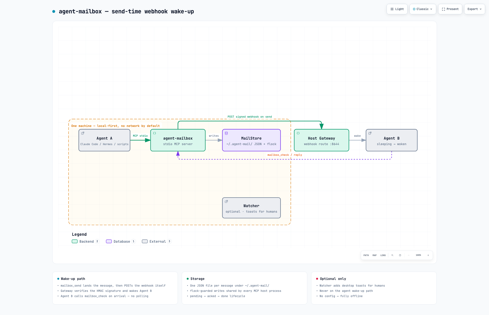

# agent-mailbox

**给每一个本地 AI Agent 一个专属信箱。** 一个 stdio MCP server，零守护进程，每封信一个 JSON 文件。

📖 **文档**: [English](README.md) · [中文](README.zh-CN.md) · [Español](README.es.md) · [Português](README.pt-BR.md) · [Français](README.fr.md) · [Русский](README.ru.md)

---

## 问题

在同一台机器上跑多个 AI agent——Claude Code、Hermes、你自己的脚本——它们之间没有互相留言的办法。要么互相等待，要么你本人在各个窗口之间复制粘贴，充当人肉交换机。

## 方案

一个信箱就是一个普通 JSON 文件目录：

```
~/.agent-mail/
  registry.json                agent_id → {owner, description, created_at}
  inbox/HS/20260905-….json     每封信一个文件
  archive/HS/…
```

Agent 通过一个小型 stdio MCP server 读写它。没有 broker 进程、不开端口、没有数据库、默认零网络。任意多个 MCP 宿主进程共享同一个邮件根目录（文件锁保护）。



## 快速开始

**前置条件** —— 一次性：安装 [uv](https://docs.astral.sh/uv/)（macOS/Linux：`curl -LsSf https://astral.sh/uv/install.sh | sh`；Windows：`powershell -c "irm https://astral.sh/uv/install.ps1 | iex"`）。其余全部由 `uvx` 运行，无需再装任何东西。

### 1 · 在你的 MCP 宿主里注册 server

Claude Code：

```bash
claude mcp add agent-mailbox -- uvx --from git+https://github.com/polaris-smart/agent-mailbox agent-mailbox
```

通用 MCP 宿主（JSON 配置）：

```json
{
  "mcpServers": {
    "agent-mailbox": {
      "command": "uvx",
      "args": ["--from", "git+https://github.com/polaris-smart/agent-mailbox", "agent-mailbox"]
    }
  }
}
```

提示：在该 agent 的环境里设一次 `AGENT_MAIL_ID=HS`（或任意 id），之后所有工具自动以它署名收发，无需每次传 `agent_id`。

### 2 · Agent 注册一次即可

```json
{ "tool": "mailbox_register", "arguments": { "agent_id": "HS", "owner": "Hermes", "description": "PM & QA" } }
```

注册幂等。注册后即可被所有人寻址——包括一个叫 `boss`、由你亲自翻看的人类信箱。

### 3 · 发信、收信、回信

```json
{ "tool": "mailbox_send", "arguments": { "to": "HS", "subject": "deploy ready", "body": "v0.1.0 已就绪，请验收。" } }
{ "tool": "mailbox_check", "arguments": {} }
{ "tool": "mailbox_reply", "arguments": { "msg_id": "20260905-…-hs", "body": "验收通过，标记 done。" } }
```

`mailbox_check` 取走待读信件并标记 `acked`。生命周期：`pending → acked → done`，之后可归档。每封信都是一个可以 `cat` 的 JSON 文件——老板直接看收件箱。

### 4 · 等信而不是轮询

`mailbox_wait` 长轮询阻塞直到有新信——作为回 合的最后一个动作调用：

```json
{ "tool": "mailbox_wait", "arguments": { "timeout_seconds": 25 } }
```

## 唤醒离线的 agent（一行配置）

如果收信 agent 根本没在运行，`mailbox_send` 可以在新信落盘的瞬间 POST 一个 webhook——无需守护进程、无需轮询、无需额外进程：

```json
// ~/.agent-mail/webhook.json   (chmod 600)
{ "url": "http://localhost:8644/webhooks/agent-mailbox", "secret": "…" }
```

密钥自己生成一次：`openssl rand -hex 32`。省略则发未签名 POST（本地测试足够；是否强制验签由接收方决定）。

宿主的 webhook 处理器收到：

```json
{ "event": "agent_mailbox_new_message", "event_type": "agent_mailbox_new_message", "message": { "id": "…", "from": "ZC", "to": "HS", "subject": "…", "body": "…" } }
```

……然后唤醒该 agent，agent 到达后调用 `mailbox_check`。集成到此为止。

- 签名 `X-Hub-Signature-256: sha256=<hmac>`（GitHub 格式——Hermes gateway 和多数 webhook 消费方都认）。
- 目标被锁定：仅 http/https、默认只允许环回/私网地址、拒绝重定向、绕过系统代理。
- 环境变量 `AGENT_MAIL_WEBHOOK_URL` / `AGENT_MAIL_WEBHOOK_SECRET` 优先于配置文件。不配置 = 完全离线。

## 工具一览

| 工具 | 说明 |
|------|------|
| `mailbox_register(agent_id, owner?, description?)` | 认领信箱；幂等 |
| `mailbox_send(to, subject, body, priority?)` | `to` = 单个 id、列表或 `"all"` |
| `mailbox_check(agent_id?, mark?)` | 取走待读信（→ `acked`） |
| `mailbox_reply(msg_id, body)` | 自动路由回原发件人 |
| `mailbox_list(agent_id?, status?)` | 列出信件，可按状态过滤 |
| `mailbox_done(msg_id)` | 标记已办 |
| `mailbox_broadcast(subject, body)` | 发给所有已注册 agent |
| `mailbox_whoami()` | agent 目录 + 邮件根路径 |
| `mailbox_wait(agent_id?, timeout_seconds?)` | 长轮询等新信 |

身份：显式传 `agent_id`，或每个 agent 设一次 `AGENT_MAIL_ID`。

## 可选：给人类看的桌面通知

配套 watcher 把每封新信打印成 JSON 行并弹出桌面通知（macOS / Linux / Windows）。它从不在 agent 唤醒路径上——agent 不需要它：

```bash
uvx --from git+https://github.com/polaris-smart/agent-mailbox agent-mailbox-watch --notify boss
```

以服务方式常驻：

| 平台 | 安装 | 验证 |
|------|------|------|
| macOS (launchd) | `scripts/install-watch-macos.sh --notify boss` | `tail -f ~/.agent-mail/watch.log` |
| Linux (systemd user) | `scripts/install-watch-linux.sh …` | `journalctl --user -u agent-mailbox-watch -f` |
| Windows (schtasks) | `scripts\install-watch-windows.ps1` | `schtasks /Query /TN AgentMailboxWatch /V` |

## 设计原则

- **本地优先** —— `~/.agent-mail/` 下的纯 JSON 文件。无 SMTP、无 IMAP、无域名、无云端中继、默认零网络。
- **注册即寻址** —— `mailbox_register("HS")` 一步完成；注册后即被所有人可见可达。
- **零外部依赖** —— 只有 `mcp`。存储是单个 Python 文件，`flock` 原子写保护；多个 MCP 宿主进程安全共享一个邮件根。
- **人类可读** —— 每封信都是一个小 JSON 文件，`cat` 即全文。老板直接看收件箱。
- **尊重既有身份** —— 每个 agent 的环境里设一次 `AGENT_MAIL_ID`，工具自动署名收发。

## 安全说明

- 邮件根在你的家目录下；除非你主动启用 webhook（默认锁定环回/私网目标），消息永不离开这台机器。
- agent id 严格校验（`[A-Za-z0-9_-]`，≤64 字符）——无路径穿越。
- 存储为追加式原子写 + 文件锁；崩溃的写入者不会损坏注册表。
- webhook 负载带 HMAC 签名；校验方应使用常数时间比较。
- 防篡改回执（ed25519）在 roadmap 上。

## 开发

```bash
git clone https://github.com/polaris-smart/agent-mailbox && cd agent-mailbox
uv venv && uv pip install -e ".[dev]"
pytest
```

## Roadmap

- **v0.1.0**（当前）—— 同机 agent 信箱，stdio MCP。零基础设施。长轮询 `mailbox_wait`、`mailbox_send` 内建 webhook 唤醒、可选 watcher。
- **v0.2.0** —— 联邦：streamable HTTP transport，让其他机器上的 agent 接入（Tailscale/LAN 友好）。
- **v0.3.0** —— 签名回执（ed25519），防篡改投递。
- **v1.0.0** —— 跨组织桥：本地会话经标准邮件基础设施触达其他机器与组织的 agent，信箱生命周期不变。

## 许可

MIT
